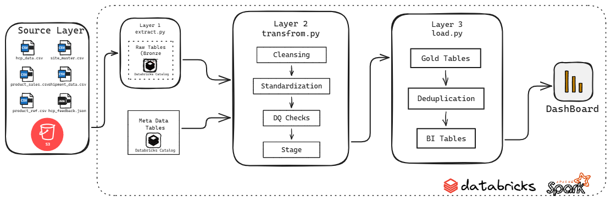
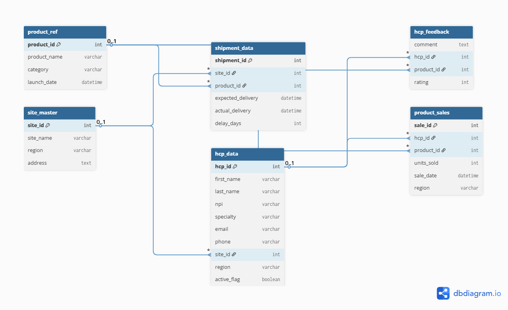
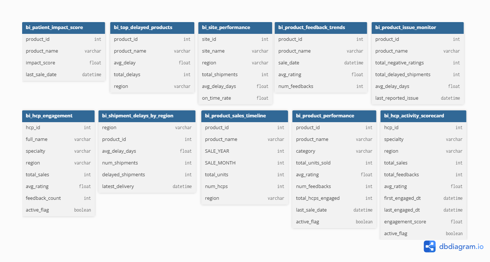
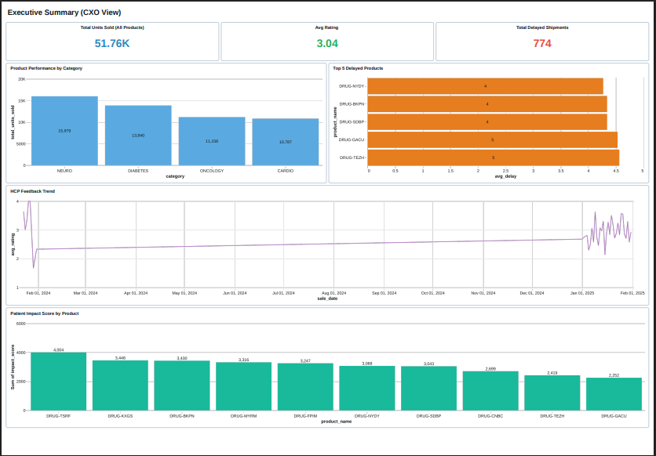
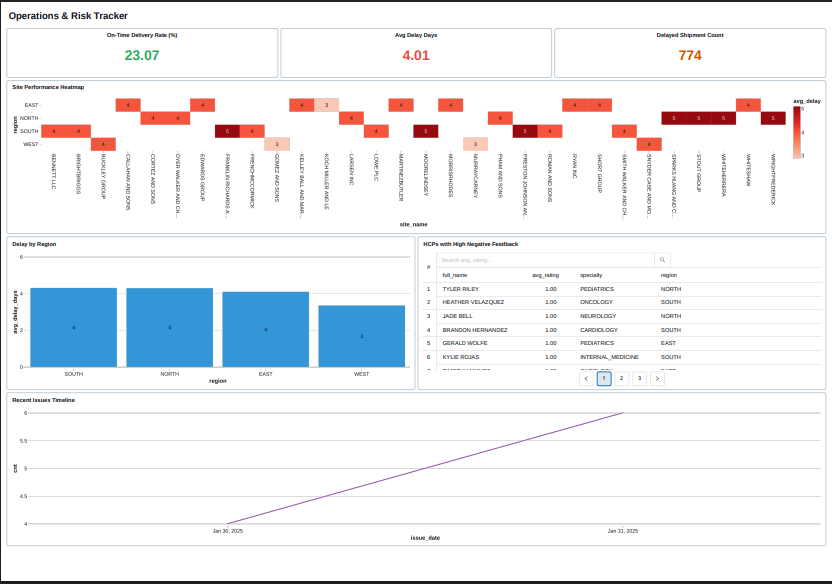

# 🏥 Healthcare Intelligence Platform – Metadata-Driven Data Engineering Project

This project is a complete, end-to-end healthcare data engineering solution that simulates real-world pharma use cases like **HCP engagement tracking**, **shipment delay analysis**, and **product performance monitoring** — using a fully **metadata-driven** architecture built on **Databricks**, **PySpark**, and **SQL**.

---

## 🔍 Business Use Case Simulated

This project mimics real-world operations of a pharma company by:

- Tracking HCP activity, specialty, and feedback  
- Monitoring delays in drug shipments  
- Analyzing product demand and performance  
- Enabling decision-makers to act quickly using BI dashboards  

**Dashboards Created**:
- 📊 **Executive Summary** – Give leadership a bird’s-eye view of product success, HCP engagement, and key risk indicators
- 🧠 **Operations & Risk Tracker (Ops/Logistics Team)** – Help middle managers & ops teams track delivery performance, HCP activity, site issues.

All KPIs are built using 10 curated BI tables from the gold layer.

---

## 🚀 What This Project Demonstrates About Me

| Area | Demonstrated Skill |
|------|---------------------|
| 🛠️ Data Engineering | Built and automated a full pipeline using PySpark + SQL in Databricks |
| 🧠 Metadata-Driven Pipelines | Configured jobs using dynamic config tables to reduce hardcoding |
| 🗂️ Data Modeling | Designed both raw and analytical BI layer models |
| ⚙️ ETL / ELT | Implemented ingestion, cleansing, standardization, DQ, deduplication, and publishing |
| 🧪 Data Quality | Applied rule-based validation using custom DQ rules from metadata |
| 📊 BI Dashboards | Created actionable dashboards using Databricks SQL |
| ☁️ Cloud | Simulated S3 ingestion paths (Databricks Volumes), Unity Catalog for governance |
| ✅ Project Ownership | Took project from design → implementation → documentation and GitHub delivery |

---

## 🧩 Project Architecture

The pipeline is implemented across 3 modular notebooks:

### 🧪 Notebooks

| Phase | Notebook | Description |
|-------|----------|-------------|
| 🔄 Extract | [01_extract.py](notebooks/extract.py) | Ingests raw files (CSV/JSON) to raw/bronze Unity Catalog tables. |
| 🔧 Transform | [02_transform.py](notebooks/transform.py) | Applies cleansing, standardization, DQ checks, and stages the data. |
| 📥 Load & BI | [03_load.py](notebooks/load.py) | Loads to gold tables, applies deduplication, publishes BI tables. |


All layers are controlled by **metadata config tables** stored in Unity Catalog. The pipeline is **fully parameterized**, with dynamic behavior based on config and mapping rules.

📌 A detailed architecture flow diagram: `/architecture.png`



---

## 🧪 Technologies Used

- **Programming Languague - PySpark**
- **Scripting Languague - SparkSQL**
- **Databricks Community Edition**
    - **Unity Catalog Tables**
    - **Databricks SQL Dashboards**
- **Metadata-driven configs**
- **AWS S3 (simulated via Databricks Volumes)**

---

## Dataset Used
Here is the dataset used - https://github.com/spayasam16/healthcare-intelligence-platform/tree/0c785fbfeaaa5284b00e77fe5ae44274e7511336/data_sample

---

## Data Model

### Raw Data Model


### BI Tables


---

## Final Dashboards





---

## 📁 Project Structure

```
healthcare-intelligence-platform/
│
├── notebooks/
│   ├── 01_extract.py
│   ├── 02_transform.py
│   └── 03_load.py
│
├── configs/
│   ├── pipeline_config.csv
│   ├── std_mapping.csv
│   ├── dq_rules.csv
│
├── data_sample/
│   ├── hcp_data.csv
│   ├── product_ref.csv
│   └── ... (all 6 raw data files used)
│
├── bi_dashboards/
│   ├── screenshots/
│   │   ├── dashboard_1_summary.png
│   │   └── dashboard_2_engagement.png
│   └── dashboard_queries.sql
│
├── datamodels/
│   ├── raw_data_model.png
│   ├── bi_data_model.png
│   └── flow_diagram.png
│
└── README.md
```

---

## 💼 Why This Project Matters for My Portfolio

- ✅ Designed with real-world enterprise readiness in mind  
- ✅ Shows skill with Databricks, PySpark, SQL, metadata-driven pipelines  
- ✅ Demonstrates ownership: from data modeling → coding → dashboards → GitHub delivery  
- ✅ Mimics what real companies are hiring for in data engineer roles

---
